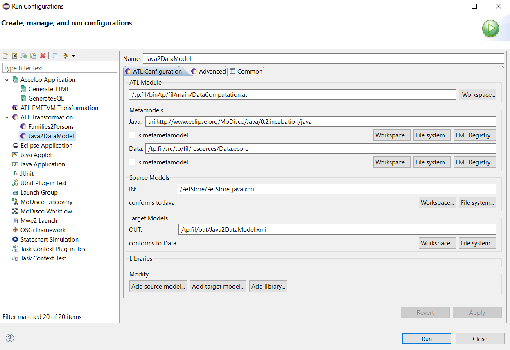
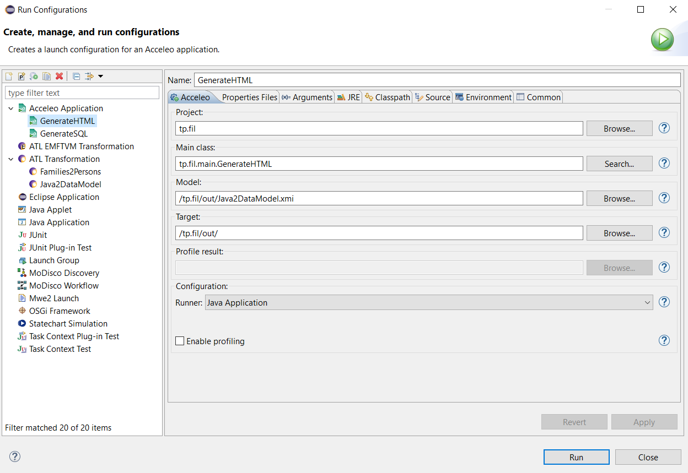
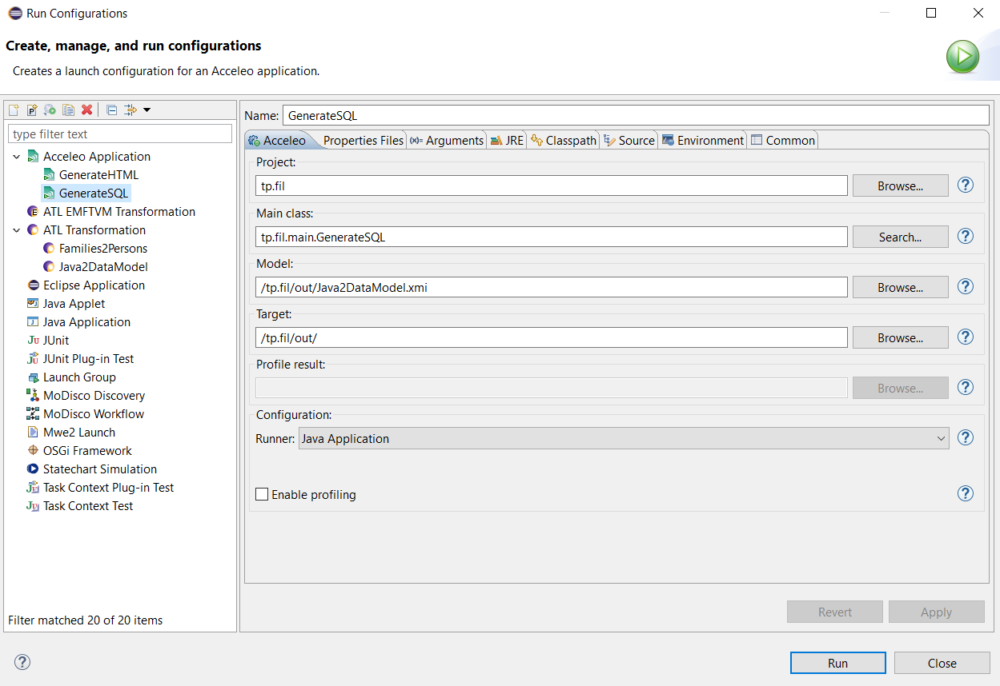

# IMT Atlantique, Nantes Campus 
Model Driven Reverse Engineering (MDRE) in practice
14th, 15th and 21st of February 2019 

## Step 2 – Extract/Compute a Data model with Java & ATL

### ATL transformation

## Step 3 – Generate a visualization and code with Acceleo

### To SQL

### To HTML

## Step 4 – Integrate as a workflow with MoDisco 
